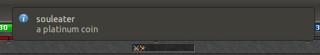

[](https://travis-ci.org/mazurwiktor/memlyzer)

# Memlyzer
Memlyzer is an Linux extension made for the MMORPG Tibia inspired by (both unfortunately **outdated**) [Tibialyzer](https://github.com/Mytherin/Tibialyzer) and [Flarelyzer](https://github.com/Javieracost/Flarelyzer)).

Memlyzer scans Tibia process memory and gathers information about looted items thanks to that user don't need to bother about e.g constantly reading loot message list.

# Features

* Loot message analyze and filter
* User notifications
* Speed and memory efficiency

# Installation

## Requirements
* **Libnotify-bin**: Library to send desktop notifications. To install it on debian based environments, you can just run `[sudo] apt-get install libnotify-bin`.


1. From [latest release](https://github.com/mazurwiktor/memlyzer/releases) download `memlyzer.tar` archive.
2. Extract archive E.g
    ```bash
    mkdir ~/memlyzer && cd ~/memlyzer
    tar xf ./memlyzer.tar
    ```
3. Run `~/memlyzer/start-memlyzer.sh`


# Configuring and usage

1. Configure loot list in file `Config.toml`
2. Look for notifications :)



# About Tibia rules

Memlyzer does not alter the Tibia client in any way, nor does it play the game for you. It only passively scans the Tibia process memoryto check for server log and chat messages and therefore it does not go against the [Tibia Rules](http://www.tibia.com/support/?subtopic=tibiarules&rule=3b).

